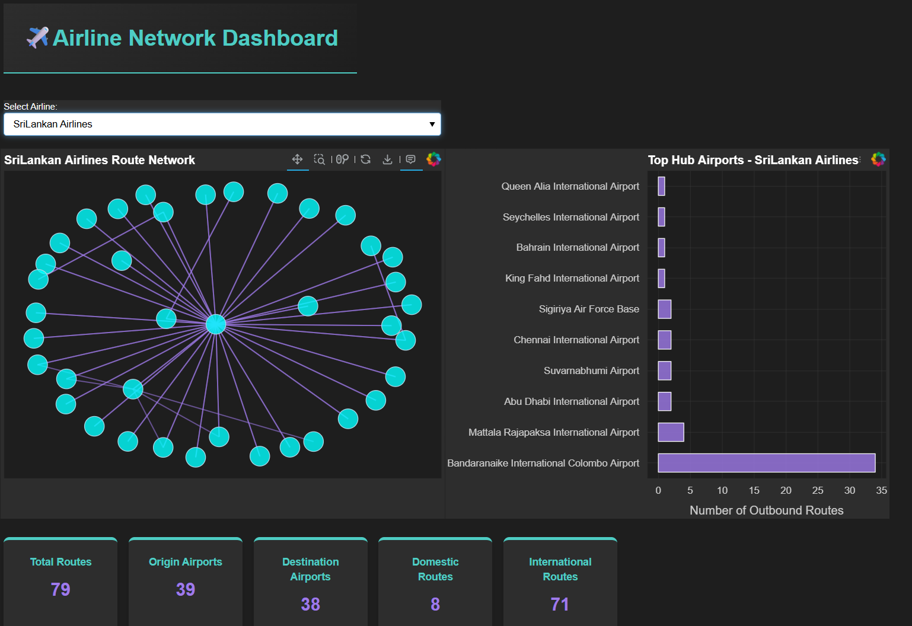

# Airline Network Visualization Dashboard

An interactive, dark-themed network analytics web application designed to explore and analyze global airline routes, airport hubs, and connectivity using a graph database backend.

---

## 🚀 Overview

This application bridges the gap between relational transit data and graph-based network analysis. By modeling airports and airlines as interconnected nodes and flight routes as structural relationships, the dashboard allows users to dynamically query, filter, and visualize complex flight networks in real time.

### Key Features
* **Interactive Force-Directed Graphs:** Dynamic network visualization with custom hover tooltips, pan, zoom, and reset functionalities.
* **Live Operational Metrics:** Real-time calculation of total routes, unique origin/destination airports, and split counts for domestic vs. international flights.
* **Hub Analytics:** Automated extraction and charting of the top 10 hub airports with the highest outbound flight frequencies for any selected airline.
* **High-Performance Backend:** Engineered with optimized Cypher database indexing to achieve sub-second query retrieval times across tens of thousands of records.

---

## 🏗️ System Architecture

The application is built using a decoupled, multi-tiered architecture to ensure clean data separation and scalable processing:

```text
┌─────────────────┐      ┌────────────────────┐      ┌────────────────────┐      ┌─────────────────┐
│   Data Layer    │ ───> │  Processing Layer  │ ───> │ Presentation Layer │ ───> │ Interface Layer │
│  (Neo4j Graph)  │      │     (NetworkX)     │      │   (Bokeh Server)   │      │ (Web Dashboard) │
└─────────────────┘      └────────────────────┘      └────────────────────┘      └─────────────────┘

---

## 🖼️ Screenshot



> If the image does not appear, make sure the file is named `screenshot.png` and is committed in the same folder as `README.md`.
